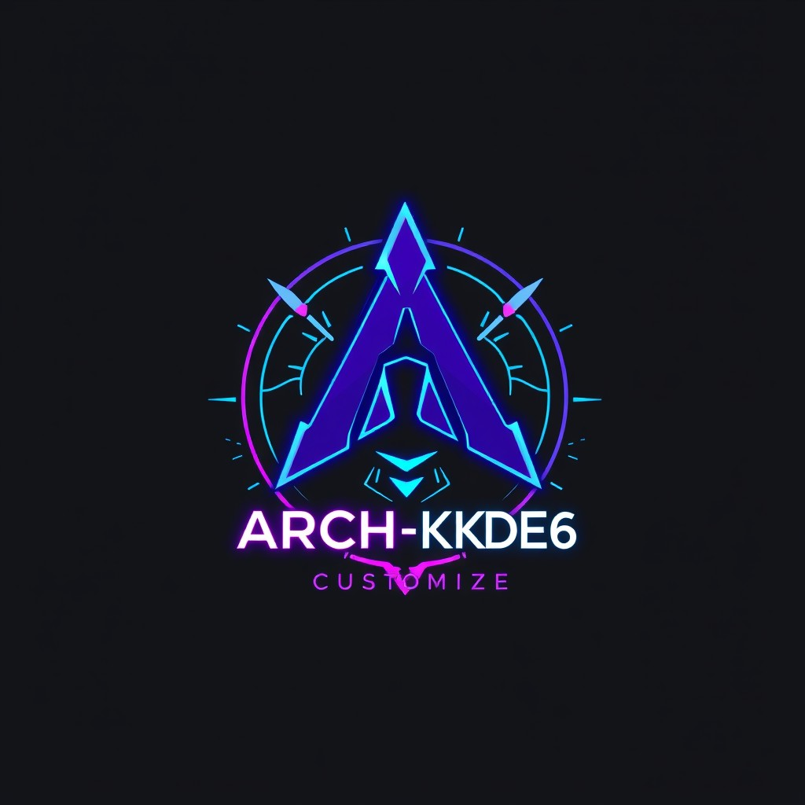
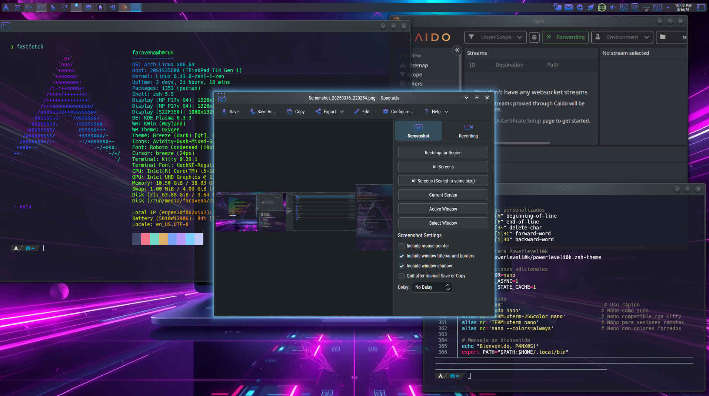
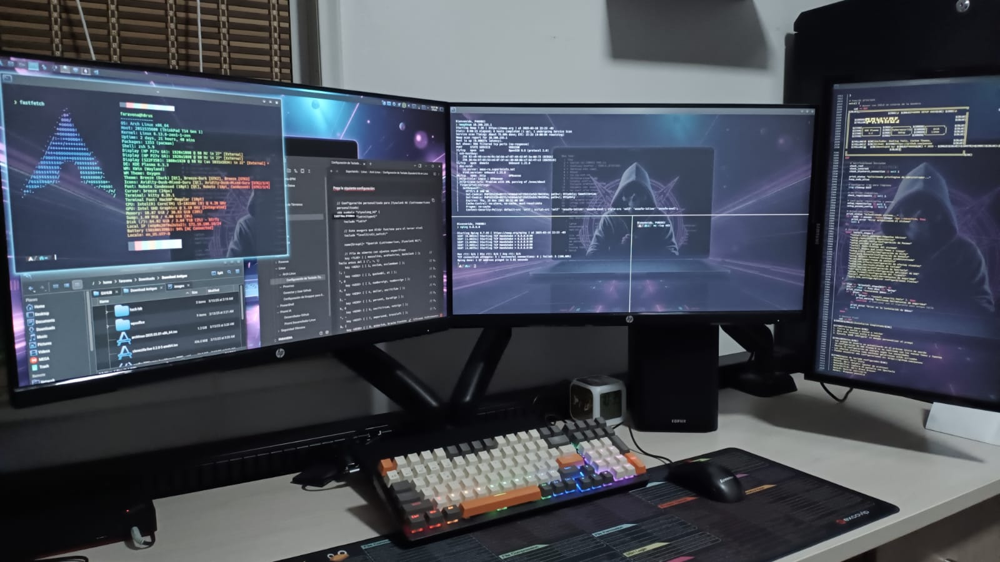

# 🚀 ARCH-KDE6-Customizer

<div align="center">
  <a href="https://github.com/panxos">
    
  </a>
  <br>
  <strong><a href="https://github.com/panxos">Francisco Aravena</a></strong>
  <br><br>
  
  <br><br>
  <strong>Personalización automatizada de Arch Linux + KDE Plasma 6 para ciberseguridad</strong>
  <br><br>
  <a href="#características">Características</a> •
  <a href="#requisitos-previos">Requisitos</a> •
  <a href="#instalación">Instalación</a> •
  <a href="#personalización">Personalización</a> •
  <a href="#herramientas-incluidas">Herramientas</a> •
  <a href="#capturas-de-pantalla">Capturas</a> •
  <a href="#licencia">Licencia</a>
</div>

## 📋 Descripción

**ARCH-KDE6-Customizer** es un script diseñado para configurar rápidamente un entorno de trabajo en Arch Linux centrado en ciberseguridad utilizando KDE Plasma 6. Este proyecto automatiza la instalación y configuración de herramientas, temas visuales y optimizaciones para crear un entorno de pentesting profesional que combina la potencia de Arch Linux con la usabilidad del entorno KDE.

A diferencia de otras configuraciones como las basadas en BSPWM (por ejemplo, las creadas por S4vitar), este proyecto se enfoca en proporcionar una experiencia de usuario más amigable con un completo entorno de escritorio KDE, manteniendo todas las capacidades necesarias para profesionales en seguridad informática.

<div align="center">
  
</div>

## ✨ Características

- **Configuración automatizada**: Instalación completa en un solo paso
- **Repositorios optimizados**: Configuración de BlackArch y Chaotic-AUR
- **Interfaz moderna**: Tema Andromeda con iconos Avidity para KDE Plasma 6
- **Terminal potente**: Kitty y Konsole con ZSH, Powerlevel10k y plugins
- **Seguridad integrada**: Herramientas de pentesting preconfiguradas
- **Personalización visual**: Efectos, animaciones y transparencias
- **Atajos de teclado**: Configuración optimizada para flujo de trabajo eficiente
- **Fuentes optimizadas**: Hack Nerd Font, IBM Plex, Inter y otras fuentes modernas
- **Firewall configurado**: Reglas UFW preestablecidas para seguridad

## 📦 Herramientas incluidas

### Paquetes básicos

| Categoría | Paquetes | Descripción |
|-----------|----------|-------------|
| **Desarrollo** | base-devel, cmake, extra-cmake-modules, git, go | Herramientas esenciales para desarrollo y compilación |
| **Sistema** | bat, btop, curl, fzf, gzip, htop, less, lsd, ncdu, neofetch, net-tools, p7zip, reflector, tree, unzip, wget, zip, zsh | Utilidades para administración y monitoreo del sistema |
| **Navegadores** | brave-browser, firefox | Navegadores web modernos y seguros |
| **Editores** | code | Visual Studio Code para desarrollo y scripting |
| **Redes** | netcat, nmap, socat, traceroute, whois, openvpn, openldap | Análisis y gestión de redes |
| **Terminales** | kitty, konsole, ttf-roboto, ttf-roboto-mono-nerd | Emuladores de terminal avanzados con fuentes optimizadas |
| **Desarrollo Web** | jdk17-openjdk, nodejs, npm | Entorno para desarrollo Java y JavaScript |
| **Seguridad Básica** | exploitdb, impacket-ba, nikto | Herramientas base para pruebas de seguridad |
| **Utilidades** | spectacle, keepassxc, obsidian, peazip, yt-dlp, lolcat | Aplicaciones para productividad y gestión de datos |
| **KDE Plasma** | plasma-systemmonitor, plasma-browser-integration, kdeplasma-addons, kdeconnect, kwallet-pam, kscreen, powerdevil, bluedevil, plasma-nm, plasma-pa, discover, packagekit-qt5, kinfocenter | Componentes para mejorar el entorno KDE Plasma |

### Herramientas de Seguridad (Opcionales)

| Categoría | Herramientas | Descripción |
|-----------|--------------|-------------|
| **Análisis de Redes** | wireshark-qt, nbtscan | Captura y análisis de tráfico de red |
| **Pentesting Web** | burpsuite, gobuster, sqlmap, dirb, wpscan, zaproxy, wfuzz, ffuf | Suite completa para análisis de vulnerabilidades web |
| **Crackeo de Contraseñas** | john, hashcat, hydra | Herramientas para auditoría de credenciales |
| **Frameworks** | metasploit, websploit, crackmapexec, netexec | Plataformas para explotación y pruebas de penetración |
| **OSINT** | maltego, theharvester | Recopilación de información de fuentes públicas |
| **Otros** | legion, seclists, proxychains-ng, gdb | Herramientas variadas para seguridad y depuración |

Todas las herramientas de seguridad se organizan automáticamente en una categoría específica en el menú de aplicaciones para facilitar su acceso.

## 🖥️ Requisitos previos

| Requisito | Detalle | Descripción |
|-----------|---------|-------------|
| **Sistema operativo** | Arch Linux | Instalación base (no funciona en otras distribuciones) |
| **Entorno de escritorio** | KDE Plasma 6 | Debe estar instalado y funcionando correctamente |
| **Conectividad** | Acceso a internet | Necesario para descargar paquetes y repositorios |
| **Almacenamiento** | Al menos 20GB libres | Espacio para la instalación completa con herramientas |
| **Memoria** | Mínimo 4GB (8GB recomendado) | Para un funcionamiento fluido con efectos visuales |
| **Usuario** | Con privilegios sudo | Necesario para realizar modificaciones en el sistema |

## 🔧 Instalación

1. Clona el repositorio:
   ```bash
   git clone https://github.com/panxos/ARCH-KDE6-Customizer.git
   cd ARCH-KDE6-Customizer
   ```

2. Otorga permisos de ejecución al script:
   ```bash
   chmod +x setup.sh
   ```

3. Ejecuta el script (NO como root):
   ```bash
   ./setup.sh
   ```

4. Sigue las instrucciones en pantalla. El script solicitará tu contraseña de sudo cuando sea necesario.

5. Al finalizar, reinicia la sesión para aplicar todos los cambios.

## ⚙️ Personalización

El script está diseñado para ser fácilmente modificable. Puedes personalizar los siguientes aspectos:

### Paquetes instalados
Edita los arrays `basic_packages` y `security_tools` en el script para añadir o quitar paquetes según tus preferencias.

### Fondos de pantalla
Agrega tus propios fondos a la carpeta `Wallpamper`. Los archivos deben seguir el formato `Arch-Linux-XX.jpeg`.

### Temas e iconos
Puedes reemplazar los archivos `Andromeda.tar.xz`, `Avidity-Dusk-Mixed-Suru.zip` y `Avidity-Total-Dusk.zip` con otros temas de tu preferencia.

### Configuración de terminales
Modifica los archivos `kitty.conf`, `color.ini`, `.zshrc`, `.p10k.zsh` y `.p10k.zsh.root` para personalizar tu experiencia de terminal.

### Atajos de teclado
Edita la sección `setup_kde_shortcuts()` para modificar los atajos de teclado según tus necesidades.

## 🔐 Herramientas de seguridad

Durante la instalación, el script te permitirá seleccionar qué herramientas de seguridad deseas instalar. Algunas de las herramientas disponibles incluyen:

- **Wireshark**: Analizador de protocolos de red
- **Metasploit**: Framework de explotación
- **Burp Suite**: Proxy de interceptación web
- **John the Ripper** y **Hashcat**: Crackers de contraseñas
- **Gobuster**, **FFUF** y **Dirb**: Herramientas de fuzzing web
- **SQLMap**: Herramienta de inyección SQL automática
- **Nmap**: Escáner de puertos y host
- Y muchas más...

## 📷 Capturas de pantalla

<div align="center">
  <p><b>Entorno de escritorio personalizado con tema oscuro y panel superior optimizado</b></p>
  
  <br><br>
  <p><b>Terminal Kitty con ZSH, Powerlevel10k y tema personalizado</b></p>
  
</div>

## ⌨️ Atajos de teclado configurados

| Categoría | Combinación | Acción |
|-----------|-------------|--------|
| **Aplicaciones** | Meta+Return | Abrir terminal Kitty |
| | Meta+E | Abrir Dolphin (gestor de archivos) |
| | Meta+Shift+B | Abrir Brave Browser |
| | Ctrl+Alt+T | Abrir Konsole |
| **Capturas** | Print | Captura de pantalla completa |
| | Meta+Shift+S | Captura de pantalla con Spectacle |
| | Meta+Print | Capturar ventana activa |
| | Meta+Shift+Print | Capturar región rectangular |
| **Ventanas** | Meta+D | Mostrar escritorio |
| | Meta+W | Vista general de ventanas |
| | Meta+L | Bloquear pantalla |
| | Meta+Ctrl+Esc | Matar ventana |
| | Alt+F4 | Cerrar ventana |
| | Meta+PgUp | Maximizar ventana |
| | Meta+PgDown | Minimizar ventana |
| **Organización** | Meta+1-9 | Cambiar a aplicación específica |
| | Meta+Tab | Recorrer actividades |
| | Alt+Tab | Recorrer ventanas |
| **Posición** | Meta+Left/Right/Up/Down | Colocar ventana en mosaico |
| | Meta+Shift+Left/Right/Up/Down | Mosaico en esquinas |

## 📝 Licencia

Este proyecto está licenciado bajo la Licencia MIT - ver el archivo [LICENSE](LICENSE) para más detalles.

```
MIT License

Copyright (c) 2025 Francisco Aravena (panxos)

Permission is hereby granted, free of charge, to any person obtaining a copy
of this software and associated documentation files (the "Software"), to deal
in the Software without restriction, including without limitation the rights
to use, copy, modify, merge, publish, distribute, sublicense, and/or sell
copies of the Software, and to permit persons to whom the Software is
furnished to do so, subject to the following conditions:

The above copyright notice and this permission notice shall be included in all
copies or substantial portions of the Software.

THE SOFTWARE IS PROVIDED "AS IS", WITHOUT WARRANTY OF ANY KIND, EXPRESS OR
IMPLIED, INCLUDING BUT NOT LIMITED TO THE WARRANTIES OF MERCHANTABILITY,
FITNESS FOR A PARTICULAR PURPOSE AND NONINFRINGEMENT. IN NO EVENT SHALL THE
AUTHORS OR COPYRIGHT HOLDERS BE LIABLE FOR ANY CLAIM, DAMAGES OR OTHER
LIABILITY, WHETHER IN AN ACTION OF CONTRACT, TORT OR OTHERWISE, ARISING FROM,
OUT OF OR IN CONNECTION WITH THE SOFTWARE OR THE USE OR OTHER DEALINGS IN THE
SOFTWARE.
```

## ❤️ Créditos y Contribuciones

Desarrollado por [Francisco Aravena](https://github.com/panxos).

Si deseas contribuir a este proyecto:
1. Haz un fork del repositorio
2. Crea una rama para tu función (`git checkout -b nueva-funcion`)
3. Realiza tus cambios y haz commit (`git commit -am 'Añade nueva función'`)
4. Sube los cambios (`git push origin nueva-funcion`)
5. Crea un Pull Request

## 📧 Contacto

- GitHub: [https://github.com/panxos](https://github.com/panxos)

---

<div align="center">
  
  <br>
  <sub>Hecho con ❤️ por <a href="https://github.com/panxos">Francisco Aravena (panxos)</a></sub>
  <br>
  <sub>© 2025 - Chile</sub>
</div>
